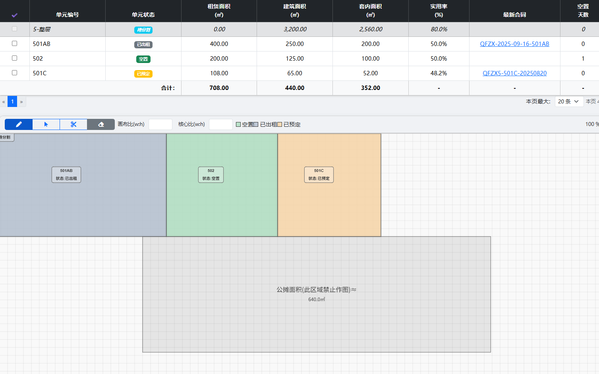
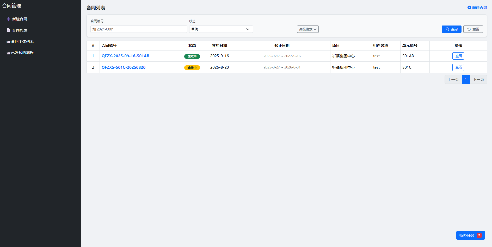

# VisiLease

A **visual and intuitive lease management system** for commercial buildings.  
VisiLease helps property managers track contracts, units, and tenants with clear dashboards and real-time status.

---
## 🌟 Highlights

  
*Visual dashboard showing unit and contract status.*

  
*Interactive contract editor and approval workflow also*

## ✨ Features
- 📊 **Visual dashboards** – Manage units and contracts at a glance  
- 🔗 **Flexible linkage** – Contracts ↔ Units ↔ Tenants  
- 🛠️ **Customizable logic** – Easily extend workflows and permissions  
- 📄 **Document management** – Upload, preview, and download contracts  
- 🔒 **Role-based access** – Secure authentication & permissions

---

## 🚀 Getting Started

### 1️⃣ Clone the repository
```bash
git clone https://github.com/cosiu1994-debug/VisiLease.git
cd VisiLease

2️⃣ Install dependencies
npm install

3️⃣ Configure environment

Create a .env file in the root and set your secrets:
DB_HOST=your-db-host
DB_USER=your-db-user
DB_PASS=your-db-password
JWT_SECRET=your-secret


📁 Project Structure
commercial_platform_apis_service/   # Core APIs
pages/                              # Front-end (AngularJS)
mq_services/                        # Message queue services
pdac-admin/                         # Admin dashboard
pdac_service/                       # Permission & workflow engine

🧰 Tech Stack

Backend: Node.js (Express)

Frontend: AngularJS

Database: MySQL / Redis

MQ: Redis Pub/Sub